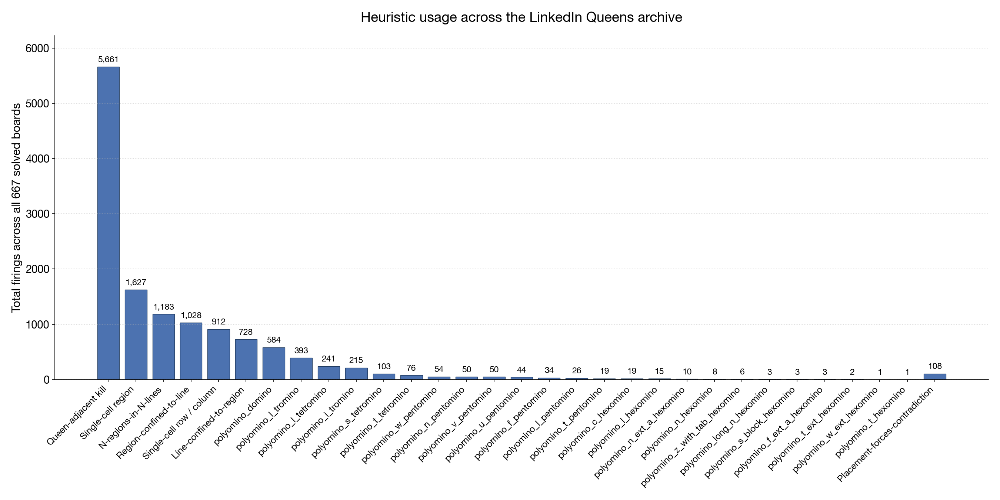

*By [Michael Spiegel](https://mspiegel.github.io/). The Rust source code, the rule writeups in [`QUEENS.md`](QUEENS.html) and [`HEURISTICS.md`](HEURISTICS.html), the design notes in [`PLAN.md`](https://github.com/mspiegel/queens-without-backtracking/blob/main/PLAN.md), and this documentation were all written with the assistance of [Claude Code](https://www.anthropic.com/claude-code), using the Claude Opus 4.7 model.*

## Hypothesis

There was a time when I was obsessed with the [LinkedIn Queens](https://www.linkedin.com/games/queens) puzzles. After solving lots and lots of them, I began to suspect that these boards did not need a backtracking algorithm to solve them. Manually I was solving the puzzles with heuristics. At most, I would resort to testing a contradiction with a short cutoff of the maximum depth. My hypothesis was that **heuristics alone could solve these boards**.

This repository is that hypothesis, tested. It ships a Rust solver that never backtracks: it runs a fixed-point of constraint-propagation rules, plus one bounded contradiction probe capped at depth 2, and that's it. Against the 667 shipped LinkedIn Queens puzzles in the archive, the heuristics carry the load.

## The puzzle

A LinkedIn Queens board is an `N × N` grid partitioned into `N` colored regions (`N` is 7 to 11 in practice, 8 is the mode). A valid solution places `N` queens such that:

1. Exactly one queen per row.
2. Exactly one queen per column.
3. Exactly one queen per colored region.
4. No two queens are [king-adjacent](https://en.wikipedia.org/wiki/King_(chess)) — Chebyshev distance must be at least 2.

Note that rule 4 is *not* the chess N-queens rule: two queens on the same long diagonal are legal as long as they're not touching. The formal statement is that queens form an independent set in the [king graph](https://en.wikipedia.org/wiki/King%27s_graph).

LinkedIn Queens is the `K = 1` case of [Star Battle](https://www.gmpuzzles.com/blog/star-battle-rules-and-info/). Star Battle is NP-complete in general, but at `N ≤ 11` any solver, even brute force, runs in microseconds. Runtime isn't the interesting question. The interesting question is whether the human solver's mental toolkit — pencil marks, Xs, forced moves — is sufficient on its own.

## Why backtracking feels unnecessary

When a human solves a Queens puzzle on paper, every cell is in one of three states: **queen**, **dead** (proven to not hold a queen), or **live** (undetermined). Placing a queen kills a predictable set of cells: the rest of its row, column, and region, plus its eight king-neighbors. That's what LinkedIn's "Auto-place Xs" toggle does.

But strong human solvers do more. They chain deductions: "this region only has live cells in one row, so the row's queen must be inside the region, so every other cell of the row is dead." Each of those chains is a named propagation rule. Run them all to a [fixed point](https://en.wikipedia.org/wiki/Fixed_point_(mathematics)) and the puzzle usually falls out.

## The heuristic toolkit

The solver runs three tiers of rules, cheapest first. Each rule is a sound deduction: given the current partial state, it either marks more cells dead or forces a cell to a queen. A driver re-invokes every rule until a full pass changes nothing. That [fixed point](https://en.wikipedia.org/wiki/Fixed_point_(mathematics)) is what the solver reports.

### Tier 1 — Baseline (5 rules)

These are the rules a careful human runs without thinking. LinkedIn's "Auto-place Xs" toggle implements only the first one; the other four are what a strong solver runs mentally.

- **Queen-adjacent kill.** When a queen is placed at `(r, c)`, every cell in the same row, column, region, or king-neighborhood becomes dead.
- **Single-cell region.** If a region has exactly one live cell, it must hold that region's queen.
- **Single-cell row / column.** Same idea, applied to rows and columns.
- **Region-confined-to-line.** If every live cell of a region shares one row (or column), the region's queen must land in that row (or column), so the rest of the line outside the region can be killed.
- **Line-confined-to-region.** The mirror: if every live cell of a row (or column) lies inside a single region, that region's queen sits in the line, so the rest of the region outside the line can be killed.

These five rules alone finish most LinkedIn boards. The interesting puzzles are the ones where they stall.

### Tier 2 — Polyomino shape rules (27 rules)

When the baseline rules reach a fixed point but the puzzle isn't solved, the remaining live cells of some region often form a recognizable [free polyomino](https://en.wikipedia.org/wiki/Polyomino) — a shape of size 2 to 6 treated up to rotation and reflection. Every such shape has a fixed list of outside cells that are guaranteed to die: the queen must sit somewhere inside the shape, and those outside cells are in the queen's row, column, or king-neighborhood *no matter which shape cell the queen ends up on*. So the solver can kill those outside cells right away, before committing to any queen placement.

A few representative examples (from the full catalog in [`HEURISTICS.md`](HEURISTICS.html)):

**Domino region** — two edge-adjacent live cells. The four cells flanking the long sides die, because each flank is king-adjacent to both domino cells.

```
. . . . .
. ✕ ✕ . .
. D D . .
. ✕ ✕ . .
. . . . .
```

**L-tromino region** — three live cells forming an L. The missing corner of the 2×2 dies (king-adjacent to all three), plus two "extension" cells opposite the elbow's arms.

```
. ✕ . .
✕ L L .
. L ✕ .
. . . .
```

**T-tetromino region** — a T-shape. The cell that would complete the T into a plus sign dies (it's in the queen's column for the central axis, king-adjacent for the bar ends).

```
. . . . .
. . ✕ . .
. T T T .
. . T . .
. . . . .
```

**V-pentomino region** — two three-cell arms meeting at a right angle. The single cell diagonally off the corner, on the concave side, dies — it's king-adjacent to every one of the five V cells.

```
. . . . .
. V . . .
. V ✕ . .
. V V V .
. . . . .
```

**C-hexomino region** — a 3×3 block with the centre and two edge cells missing. The centre of the 3×3 dies: it's within king-distance of every hexomino cell.

```
. . . . .
. # # # .
. # ✕ # .
. # . . .
. . . . .
```

The catalog covers every polyomino of size 2–6 that has at least one always-dead outside cell: one domino rule, two tromino rules, four tetromino rules, eight pentomino rules, and twelve hexomino rules. Shapes like the I-tetromino and I-pentomino are covered entirely by the baseline `region-confined-to-line` rule, so no polyomino rule is needed for them.

### Tier 3 — Pigeonhole and bounded contradiction

When shape rules stop firing too, two more families of rules kick in.

**N-regions-in-N-rows** and **N-regions-in-N-columns** apply [pigeonhole](https://en.wikipedia.org/wiki/Pigeonhole_principle) reasoning *across* regions. If `N` distinct regions have all their live cells confined to `N` rows, those rows collectively supply the queens for exactly those regions — so any live cell of any *other* region sitting in those rows can be killed. The column-wise rule is the mirror image. The `N = 1` case reduces to `region-confined-to-line`; this is the strict generalization.

**Placement-forces-contradiction** is the one concession to search. For each live cell `(r, c)`, the solver simulates placing a queen there, runs at most **two** baseline propagation passes, and checks whether any region ends up with zero live cells or any line ends up with two queens. If so, `(r, c)` can be safely killed: it cannot hold a queen in any valid solution. The depth cap `k = 2` is deliberate — this is the line I drew between heuristics and backtracking. At `k = 1` the rule collapses to a direct "kill list swallows another region" check; at `k ≥ 3` it starts approximating full search. Two passes is enough to catch the chains a human spots — placing a queen kills one cell of each of several small regions, each of those regions then force-moves to its last remaining cell, and two of those forced cells collide in a row or column — without turning the solver into a tree search.

Full pseudocode and validity arguments for every rule live in [`HEURISTICS.md`](HEURISTICS.html). The rules of the puzzle itself live in [`QUEENS.md`](QUEENS.html).

## Results

I was able to scrape the web for 667 historical LinkedIn Queens puzzles. I have not published the boards themselves on this site — only the solver, and the aggregate statistics below. **The solver correctly solved all 667 puzzles, using only the heuristics described above and no backtracking.**

The archive ranges in size from 7×7 to 11×11. The distribution is centered on 8×8 (256 boards, ~38%), with 9×9 (193) as the next most common. Smaller 7×7 boards account for 112. Larger sizes taper off: 74 boards at 10×10 and 32 at 11×11.



The chart shows which rules actually fire. Single-cell region and queen-adjacent kill dominate, as you'd expect. The polyomino rules fire less often but unlock puzzles the baseline rules alone can't finish. The cheap tier (baseline + polyomino + pigeonhole) solves the vast majority on its own; the bounded contradiction probe picks up the stragglers.

### Followup questions

Solving every shipped puzzle with heuristics alone is good evidence for the hypothesis, but it raises several questions I can't yet answer:

- **Selection bias.** Are the shipped boards selected specifically because they admit a heuristic solution? LinkedIn's designers run their own QA on every board before it ships; if that QA is heuristics-based, puzzles that stall under it would never reach the archive. The hypothesis could hold for shipped boards while still being false of Queens puzzles in general.
- **Uniqueness.** Every shipped board has exactly one correct solution. Does that property make heuristics sufficient on its own? A unique-solution puzzle has strictly more structure for propagation to exploit; a puzzle with multiple solutions might stall a heuristics-only solver where a backtracker would still find any one of them.
- **Polyomino sufficiency.** Can it be proven, for some pair `(n, N)`, that polyomino heuristics of size up to `n` — plus the baseline and pigeonhole rules — suffice to solve every `N × N` board with a unique solution? A positive answer would turn the hypothesis from empirical observation into a theorem.

These are open. The code in this repository is one data point in their favor.

## Running the solver

The solver is a Rust binary that reads a board on stdin and writes the solution (or a partial state if the heuristics don't fully resolve it) to stdout.

```
cargo build --release
cat archive/boards/<id>.txt | ./target/release/queens-solver
```

Board format is the whitespace-separated letter grid shown in [`QUEENS.md`](QUEENS.html): one letter per cell, same letter means same region.

## Links

- [GitHub repository](https://github.com/mspiegel/queens-without-backtracking) — source code
- [`QUEENS.md`](QUEENS.html) — the rules of the puzzle
- [`HEURISTICS.md`](HEURISTICS.html) — every propagation rule with pseudocode and validity
